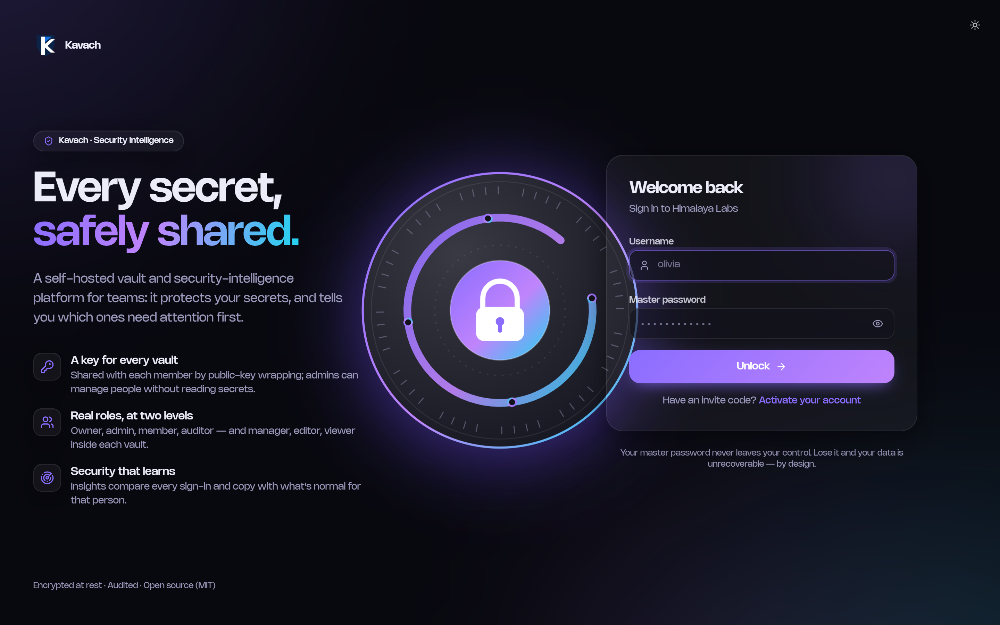
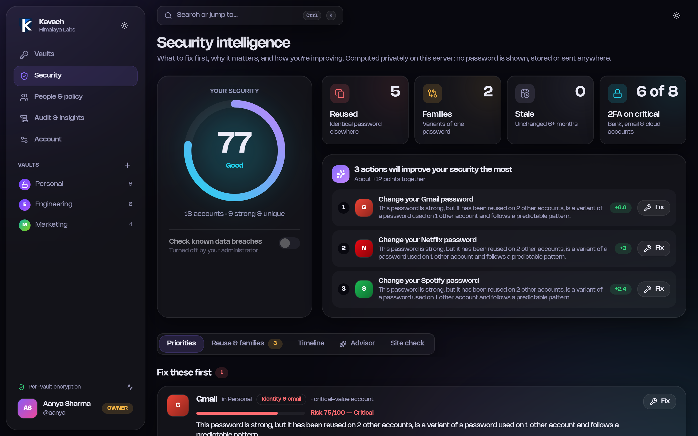
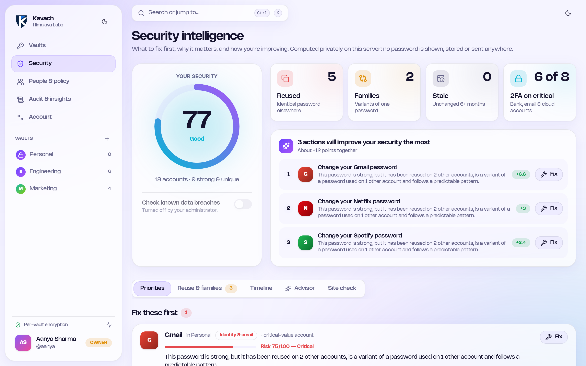
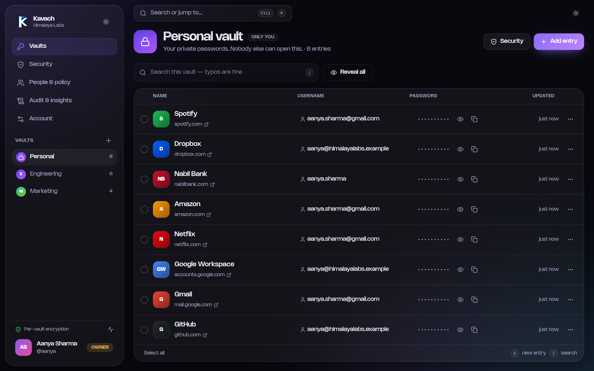
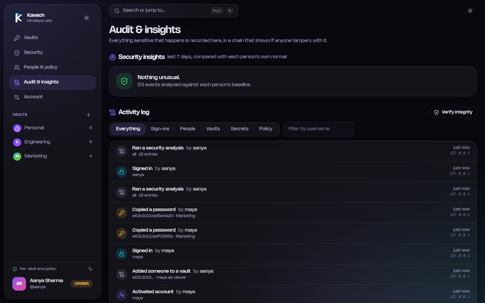

# Kavach — Security Intelligence

*Kavach* (कवच) — Sanskrit/Nepali for "armour".

A self-hosted, multi-user password manager for teams that also tells you **which of your secrets need
attention first, and why**. Every person has their own account and personal vault; teams share credentials
through shared vaults with fine-grained roles; every sensitive action is audited. Python (FastAPI + SQLite)
does all the security-critical work; the interface is a static **Next.js / React / TypeScript / Tailwind**
app the same server serves.

> *Private, explainable security intelligence: it analyses your passwords without learning them. Nothing
> is sent to an outside AI, and every score can be traced to named factors.*

> **Status: early / unaudited.** It has not had an independent security review. Read
> [Limitations](#limitations) before storing anything you cannot afford to lose.

<p align="center"></p>

## A look inside

*Screenshots use fictional demo data.*

**Security intelligence** — a score, the reasons behind it, and the few fixes that help most. Dark and light themes:

<p align="center">
  
  
</p>

**Shared vaults** and a tamper-evident **audit log** with insights judged against each person's own baseline:

<p align="center">
  
  
</p>

## Features

- **Accounts and roles** — organisation roles (owner, admin, member, auditor) and per-vault roles
  (manager, editor, viewer).
- **Personal and shared vaults** — sharing works with people who are offline; removing someone or
  disabling their account replaces the vault key.
- **Invite-only onboarding** — an admin issues a one-time invite code; the new user chooses their own
  master password, so nobody else ever knows it.
- **Email delivery** — invite codes with a one-click sign-up link, security alerts to the person (sign-in from a
  new address, lockout, password / two-factor / email changes) and a weekly summary for admins. Optional, over
  your own SMTP server. See [Email](#email).
- **Two-factor authentication** — standard authenticator apps (TOTP, RFC 6238) with QR enrolment, replay
  protection and admin reset for lost phones.
- **Audit log** — sign-ins, failures, lockouts, membership changes, and every password reveal/copy, in a
  hash chain so tampering is detectable.
- **Security intelligence** — a risk score with reasons for every account ("This password is strong, but it
  has been reused on 2 other accounts"), an impact-weighted vault score, and a ranked "these 3 actions help
  most" list with the points each fix is worth. See [How the intelligence works](#how-the-intelligence-works).
- **Password families** — variants like `Kathmandu@2025` / `Kathmandu@2026!` are detected, not just identical
  passwords.
- **Prioritisation** — priority = likelihood of compromise × how much the account matters (bank and email
  before shopping), with aging, two-factor and breach severity folded in.
- **Autofill risk engine** — for any address: *autofill*, *ask first*, or *block*, personalised to the sites you
  have saved (a page imitating a saved login is blocked and names the login it imitates).
- **Browser extension** — the autofill risk engine in your toolbar: fills a saved login only on the site it
  belongs to, and refuses on a page it judges to be phishing. See [extension/](extension/README.md).
- **Security advisor** — ask "How secure am I?" or "What should I fix today?" and get plain-language answers
  built from the verdicts (no LLM, no secrets), plus a **security timeline** of how you are improving.
- **Breach check (opt-in)** — HIBP k-anonymity lookup: only a 5-character hash prefix leaves the server, off
  unless an admin enables it.
- **Audit insights (for admins)** — adaptive anomaly detection on the audit log, judged against each person's own
  baseline: copy/reveal bursts, sign-ins from new addresses or at unusual hours, password spraying,
  success-after-failures, risky admin actions, lockouts. Statistical and explainable by design.
- **Lookalike-URL warnings** (`paypa1.com`, homoglyph hosts, `paypal.com.evil.io`) and **typo-tolerant
  search** (`gthub` finds GitHub) that never looks at passwords.
- **A polished interface** — dark/light themes, command palette (Ctrl+K), keyboard shortcuts, copy with a
  draining 30-second clipboard ring, reveal-with-auto-hide, idle-lock warning, responsive layout.

## Quick start (Windows / PowerShell)

Everything installs **inside the project** — a Python virtual environment (`.venv`) and
`frontend\node_modules` — so nothing touches your global Python or your other projects.

```powershell
.\scripts\setup.ps1     # once: creates .venv, installs dependencies, builds the web UI
.\scripts\start.ps1     # runs Kavach on http://127.0.0.1:8050
```

Prefer to do it by hand (any OS)?

```bash
python -m venv .venv
.venv/bin/python -m pip install -r requirements.txt          # Windows: .venv\Scripts\python
cd frontend && npm ci && npm run build && cd ..
.venv/bin/python -m kavach
```

The first visit shows a setup screen: name your organisation and create the first owner. Then use
**People & policy** to invite colleagues. Requires Python 3.10+ and Node.js 20+ (Node is only needed to
build the interface).

### Development

```powershell
.\scripts\dev.ps1       # API on :8050 (dev mode) + Next.js dev server on http://localhost:3100
```

The dev server runs on **3100** (not 3000) so it never clashes with other Next.js projects, and proxies
`/api` to the Python server. After changing the API, regenerate the frontend's types:
`cd frontend && npm run gen:api`.

| Environment variable | Meaning | Default |
|---|---|---|
| `KAVACH_DATA_DIR` | Where `kavach.db` and `server.key` live | `./data` |
| `KAVACH_HOST` / `KAVACH_PORT` | Bind address | `127.0.0.1` / `8050` |
| `KAVACH_TRUST_PROXY` | Use `X-Forwarded-For`/`-Proto` from a reverse proxy | off |
| `KAVACH_COOKIE_SECURE` | Force the `Secure` flag on the session cookie | auto (on for HTTPS) |
| `KAVACH_ALLOWED_ORIGINS` | Extra origins allowed to call the API (comma-separated) | none |
| `KAVACH_DEV` | Dev mode: allow `localhost:3100`, serve `/api/docs` | off |
| `KAVACH_SMTP_HOST` / `KAVACH_SMTP_PORT` | Outgoing mail server (see [Email](#email)) | off / `587` |
| `KAVACH_SMTP_SECURITY` | `starttls`, `ssl` or `none` | `starttls` |
| `KAVACH_SMTP_USER` / `KAVACH_SMTP_PASSWORD` | Mail server login, if it needs one | none |
| `KAVACH_MAIL_FROM` | The From address, e.g. `Kavach <kavach@example.com>` | none |
| `KAVACH_PUBLIC_URL` | Address people use to reach Kavach; used for links in emails | `http://HOST:PORT` |

## Email

Email is off until you give Kavach an SMTP server. Set `KAVACH_SMTP_HOST` and `KAVACH_MAIL_FROM` (plus
`KAVACH_SMTP_USER` / `KAVACH_SMTP_PASSWORD` if the server needs a login) and restart. The credentials live only
in the environment, never in the database or the API. Then open **People & policy → Security policy**, where the
*Email delivery* panel shows the settings, sends you a test message (with the server's real error if it fails)
and lists recent deliveries.

```powershell
$env:KAVACH_SMTP_HOST = 'smtp.example.com'
$env:KAVACH_MAIL_FROM = 'Kavach <kavach@example.com>'
$env:KAVACH_SMTP_USER = 'kavach@example.com'
$env:KAVACH_SMTP_PASSWORD = '...'
$env:KAVACH_PUBLIC_URL = 'https://kavach.example.com'
.\scripts\start.ps1
```

| Email | To | When |
|---|---|---|
| Invite | the invitee | an admin invites, re-issues an invite or resets access (untick "Email them the invite" to hand the code over yourself) |
| Sign-in from a new address | the person | they have signed in before, but never from this address |
| Lockout, password changed, two-factor on/off/reset, email changed | the person | it happens (the old address is told about an email change) |
| Weekly summary | owners and admins | once a week: anomalies in the audit log, pending invites, who has no two-factor, audit-chain health |

Alerts and the summary each have a switch in the security policy. The alerts contain **no links** (so a real one
cannot be mistaken for a phishing "click to secure your account"), and no email ever contains a password or vault
data. The one secret is the invite code: it works once and expires, but anyone who can read that mailbox
before the invitee can activate the account, so use the hand-over option for sensitive accounts.

Sending never blocks or fails an action: messages go through a background queue with retries, and every
outcome (`mail.sent` / `mail.failed`) is written to the audit log. The weekly summary is built from the audit log
and people list only, so it works while nobody is signed in and never touches a vault. Where alerts go is the
address on each account; people change theirs on the Account page (needs the master password).

## How the intelligence works

Everything runs in-process on entries the signed-in person can already decrypt, and returns **verdicts
only**: scores, counts and service names, never a password or a fragment of one.

| Piece | How it works |
|---|---|
| Strength | [zxcvbn](https://github.com/dropbox/zxcvbn) pattern-based guessability (dictionary words, keyboard walks, dates, l33t, repeats) |
| Risk | Noisy-OR of named factors: strength, patterns, predictable substitutions, personal details, reuse, password family, age, known breach; reduced when two-factor is marked on. Each factor has a plain-language explanation. |
| Importance | Keyword rules infer an account's category from its name and URL (financial/identity 1.0 … forum 0.3) |
| Priority | probability × importance → critical / high / medium / low |
| Vault score | 100 × (1 − importance-weighted mean probability) |
| Actions | Greedy: pick the fix worth the most, re-score as if done, repeat. The predicted gain is tested against actually re-scoring. |
| Families | Trim numbers/symbols, fold `@→a 0→o …`, compare roots and string similarity |
| Autofill decision | phishing signals from the URL text + a match against your saved sites |
| Advisor | intent matching over the verdicts above |

**Be honest about what this is.** It is rules and statistics, deliberately, not a neural network: there is no
labelled data to train on, and every number here can be explained to a person. The factor probabilities are
hand-calibrated. The design leaves room to swap in trained models (logistic regression, gradient boosting,
anomaly detection) behind the same interface.

**What it does not do (yet):** monitor whether your *email address* appears in breaches (needs a paid
third-party API and would send identities out); or look up domain age, TLS certificates or redirect chains
(needs live network lookups on every site).

## Roles

| Organisation role | Can |
|---|---|
| **Owner** | Everything: appoint admins/owners, all policy, all people |
| **Admin** | Invite/disable/reset members and auditors, edit policy, read the audit log, delete vaults |
| **Member** | Personal vault; create and join shared vaults |
| **Auditor** | Read the audit log and people list only; no vaults |

| Vault role | Can |
|---|---|
| **Manager** | Everything in the vault, including who has access and deleting it |
| **Editor** | Add, edit, delete entries |
| **Viewer** | Read and copy passwords |

Being an admin does **not** grant access to anyone's vault contents. Admins see that a vault exists and who
is in it, never what is inside.

## Architecture

```
browser ── Next.js static site (React, TypeScript, Tailwind) ──┐
                                                                │  JSON over /api, httpOnly session cookie
FastAPI (kavach/api) ── service layer (accounts, vaults, health, insights, …) ── SQLite (WAL)
```

- `kavach/` — the tested core: `crypto.py`, `accounts.py`, `vaults.py`, `audit.py`, `insights.py`,
  `phishing.py`, `search.py`, `totp.py`, …
- `kavach/intel/` — the security-intelligence engine: `risk.py`, `families.py`, `categories.py`,
  `siteguard.py`, `advisor.py`, `timeline.py`.
- `kavach/api/` — thin FastAPI layer: routes, error mapping, CSRF/security-header middleware, and the
  static file server for the built interface.
- `frontend/` — the Next.js app. API types are generated from the backend's OpenAPI schema so the two
  cannot drift.
- Data is stored in a single SQLite file (`kavach.db`, WAL mode, foreign keys enforced).

## How the encryption works

- Your **master password** is stretched with scrypt (N=2^17) into a key that protects your private key.
  Nothing derived from the password is stored; a login is checked by decrypting that key.
- Every user has an **X25519 key pair**. Every vault has its own random **AES-256-GCM key**, stored once
  per member, sealed to that member's public key. That is what lets a manager share a vault with someone
  who is not signed in, and lets admins manage people without being able to read secrets.
- Entries are encrypted under the vault key with additional authenticated data binding each ciphertext to
  its entry and vault, so the database cannot swap them around undetected.
- Removing a member, disabling a user or resetting access **rotates the vault key**.

### Web security

- The session token lives in an **httpOnly, SameSite=Strict** cookie: page scripts (and so any XSS) cannot
  read it, and it is never sent cross-site. Sessions are held in server memory with idle and absolute limits.
- State-changing API calls require a custom header and refuse cross-origin requests (CSRF defence in depth).
- A strict Content-Security-Policy, `X-Frame-Options: DENY`, `nosniff`, no-referrer and `no-store` on the API.
- The interface never caches a decrypted entry, hides revealed passwords after 15 seconds, wipes the
  clipboard 30 seconds after a copy, and only turns `http(s)` entry URLs into links.

### Threat model — please read

- The server briefly holds your master password and decrypted keys **in memory** while you are signed
  in (this is not end-to-end/zero-knowledge encryption in the browser). Someone with full control of the
  running server process can read unlocked vaults; someone with only the database file cannot.
- **Run it behind TLS.** The bundled server speaks plain HTTP on `127.0.0.1`. For real use put a reverse
  proxy with HTTPS in front (set `KAVACH_TRUST_PROXY=1`) and run a single worker process.
- A forgotten master password is unrecoverable by design. An admin's *Reset access* issues a new invite but
  the user's personal vault is gone; shared vaults are re-shared by their managers.
- Two-factor seeds are the one secret the server must read, so they are encrypted with `server.key`, kept
  apart from the database. Back the two up separately (`manage.py backup` writes both).
- The audit log's hash chain detects edits and deletions in the middle of the log. Someone who can rewrite
  the whole database can rewrite the whole chain; forward the log elsewhere if that matters to you.
- Security insights use the sign-in IP the server sees; behind a reverse proxy that is the proxy's address
  unless `KAVACH_TRUST_PROXY` is set.
- Failed-login lockout is per account, so someone can deliberately lock a colleague out for a few minutes.

## Administration

```powershell
.venv\Scripts\python manage.py backup <file>                 # consistent snapshot + server.key
.venv\Scripts\python manage.py verify-audit                  # check the audit log's hash chain
.venv\Scripts\python manage.py info                          # record counts
.venv\Scripts\python manage.py import-legacy --from <folder> --user <username>
```

`import-legacy` reads the old single-user `config.json`/`passwords.json` (never modifying them; it asks for
the old master and secondary passwords) and adds the entries to your personal vault. Delete the old files
afterwards.

## Limitations

- Sessions live in server memory: restarting the server signs everyone out, and a multi-process deployment
  needs sticky sessions or a single worker.
- Email is one-way and unverified: Kavach does not check that an address belongs to the person, and there is
  no "forgot password" email (a master password cannot be recovered by design).
- The per-user security digest (your own score by email) is not offered: scoring needs your vault unlocked, and
  Kavach only holds keys while you are signed in.
- Two-factor is opt-in per user; there is no organisation-wide "require 2FA" setting yet.
- No password sharing links or attachments yet.

## Tests

```powershell
.venv\Scripts\python -m pytest            # backend: crypto, permissions, rotation, API, CSRF, 2FA, …
cd frontend; npm test; npm run typecheck  # frontend unit tests and type check
```

## License

MIT — see [LICENSE](LICENSE).
